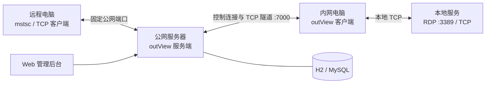

<div align="center">

# outView

**自托管远程桌面与 TCP 内网穿透**

一个设备码，连接远方的电脑；一台服务器，掌握自己的访问入口。

[](https://github.com/jeesoul/out-view/releases/latest)
[](LICENSE)
[](pom.xml)
[](client/go.mod)
[](https://outview.jeesoul.com/)

[官网](https://outview.jeesoul.com/) · [快速开始](#快速开始) · [文档](#文档) · [下载发布包](https://github.com/jeesoul/out-view/releases) · [问题反馈](https://github.com/jeesoul/out-view/issues)

</div>

outView 把内网电脑上的 RDP 或其他 TCP 服务映射到你自己的公网服务器。被控端主动建立隧道，控制端通过设备码或固定公网端口访问目标设备，无需为每台内网电脑单独配置路由器端口转发。

项目由 Java 服务端和 Go 客户端组成，提供 Windows 图形客户端、命令行客户端与 Web 管理后台。当前稳定传输路径为 TCP 中继；WebRTC 保留为实验模块，不能按生产传输能力使用。

> **当前版本**：`v1.2.1`。Windows、Linux 和 macOS 客户端已随 GitHub Release 提供；版本变更见 [CHANGELOG](CHANGELOG.md)，文件校验见 Release 中的 `SHA256SUMS`。

## 能力概览

| 能力 | 说明 |
| --- | --- |
| 设备码连接 | Windows GUI 显示六位设备码，控制端查询设备后可启动系统远程桌面。 |
| 固定端口映射 | 为在线或离线设备预留公网端口，断线重连与服务端重启后继续复用。 |
| 自动恢复 | 控制连接、注册和心跳都有超时边界；网络恢复后客户端持续重连并重新注册。 |
| 多连接转发 | 每条远程连接独立转发，关闭通知、旧会话归属和有界队列共同保护资源。 |
| 管理后台 | 登录后查看设备、断开连接、封禁设备，以及预设、修改和删除固定端口。 |
| GUI 与 CLI | GUI 面向 Windows RDP 场景；CLI 可转发任意本地 TCP 服务并支持配置文件。 |
| 自托管 | 默认使用 H2 文件数据库，也可配置 MySQL；服务端地址、端口范围和数据目录可自定义。 |

## 工作原理



RDP 的桌面显示、键鼠交互和登录认证由 Windows 系统处理，outView 负责设备发现、连接转发、固定端口和连接生命周期。

## 快速开始

### 1. 准备服务端

开发或自建部署需要 JDK 8、Maven 和 Go 1.24+；使用已构建的发布包时不需要安装 Go 或 Maven。将配置示例复制为 `application.yml`，设置管理账号后启动：

```powershell
java -jar outview-server.jar
```

默认端口如下，生产环境请按实际配置放通：

| 端口 | 用途 |
| --- | --- |
| `8080` | 管理后台与 HTTP API |
| `7000` | 客户端注册、心跳、设备查询与 TCP 隧道 |
| `6000–6500` | 固定公网端口池，可在服务端配置中调整 |

### 2. 启动被控端

Windows 发布包提供 GUI 和 CLI。GUI 中进入“被控端（本机）”，填写服务端地址并点击“启动被控服务”；注册成功后界面会显示设备码。

CLI 示例：

```powershell
.\outview-client-cli-windows-amd64.exe -host tunnel.example.com -port 7000 -device-id office-pc -token YOUR_TOKEN -local-port 3389
```

远程桌面场景要求被控电脑已开启可用的 Windows RDP；端口映射不会替系统开启 RDP。

### 3. 连接设备

登录管理后台，在“固定端口管理”中为设备 ID 预设允许范围内的外网端口。远程电脑可使用系统远程桌面连接：

```powershell
mstsc /v:tunnel.example.com:6001
```

也可以在另一台 GUI 客户端中输入六位设备码进行设备查询。固定映射与设备 ID、持久数据目录关联，升级时请保留二者。

## 客户端平台

| 平台 | 客户端形态 | 当前状态 |
| --- | --- | --- |
| Windows x64 | GUI + CLI | [下载发布包](https://github.com/jeesoul/out-view/releases/download/v1.2.1/outview-1.2.1-windows-x64.zip) |
| Linux x64 | CLI | [下载发布包](https://github.com/jeesoul/out-view/releases/download/v1.2.1/outview-1.2.1-linux-amd64.tar.gz) |
| Linux ARM64 | CLI | [下载发布包](https://github.com/jeesoul/out-view/releases/download/v1.2.1/outview-1.2.1-linux-arm64.tar.gz) |
| macOS Intel | CLI | [下载发布包](https://github.com/jeesoul/out-view/releases/download/v1.2.1/outview-1.2.1-macos-amd64.tar.gz) |
| macOS Apple Silicon | CLI | [下载发布包](https://github.com/jeesoul/out-view/releases/download/v1.2.1/outview-1.2.1-macos-arm64.tar.gz) |

Linux 和 macOS 的 CLI 与 Windows CLI 共用同一套连接核心，可转发 RDP 以外的 TCP 服务。当前 Windows GUI 依赖 Fyne 原生窗口和 CGO，未提供 Linux/macOS GUI。

## 配置与数据

服务端常用配置：

```yaml
outview:
  bind-address: 0.0.0.0
  control-port: 7000
  data-port-start: 6000
  data-port-end: 6500
  heartbeat-timeout: 90
```

固定映射默认保存在 `data/outview.mv.db`，可通过 `OUTVIEW_DATA_DIR` 指定持久目录。完整配置、升级和排错步骤见 [用户手册](docs/USER_MANUAL.md)。

## 构建与验证

```powershell
# Windows
.\scripts\build.bat
.\scripts\test.bat

# 生成 Windows、Linux、macOS CLI 以及各平台 Sidecar
.\scripts\build.ps1 -Release -SkipServer
```

```bash
# Linux / macOS
bash scripts/build.sh
bash scripts/test.sh
```

Windows GUI 原生构建额外需要 MinGW GCC / CGO。构建产物默认输出到 `artifacts/outview-<版本>/`，跨平台 CLI 位于 `client/<平台>/`。脚本会拒绝覆盖已有输出目录。当前验证覆盖 Java、Go、GUI 软件驱动测试、构建脚本契约及真实 JAR + CLI 回环；125 秒回环结果不等同于公网、真实 RDP 或小时级稳定性保证。

## 项目结构

```text
src/main/java/com/outview/       Java 服务端、协议和生命周期管理
src/main/resources/static/       管理后台静态资源
client/cmd/                      CLI / GUI 入口
client/internal/client/          控制连接、转发和配置
webrtc-sidecar/                  实验性 WebRTC / IPC 模块
scripts/                         构建、测试和启动脚本
test/soak/                       真实 JAR + CLI 回环验收
installer/windows/               Windows 安装器脚本
docs/                            用户、开发、架构和排错文档
website/                         outview.jeesoul.com 静态官网
```

## 文档

- [用户手册](docs/USER_MANUAL.md)：部署、客户端、固定端口与升级
- [开发指南](docs/DEVELOPER_GUIDE.md)：工具链、构建、测试与维护
- [架构说明](docs/ARCHITECTURE.md)：数据路径、状态和模块职责
- [故障排查](docs/TROUBLESHOOTING.md)：长连接、重连和端口问题
- [更新记录](CHANGELOG.md)
- [官网源码与部署](website/README.md)

## 发布包

`v1.2.1` 发布包位于 [GitHub Releases](https://github.com/jeesoul/out-view/releases/tag/v1.2.1)，包含 Windows x64、Linux x64/ARM64 和 macOS Intel/Apple Silicon 的独立压缩包及 `SHA256SUMS`。本地构建目录为 `release/outview-1.2.1-platforms/`。

## 当前边界

WebRTC 代码仍为实验模块，当前发布主链路是 TCP 中继。隧道 Token 签发校验与 Go 客户端 TLS 尚未形成完整链路；管理后台登录认证不等同于隧道接入认证。部署前请阅读 [部署说明](docs/USER_MANUAL.md) 并限制管理入口访问来源。

## 参与贡献

欢迎通过 [Issues](https://github.com/jeesoul/out-view/issues) 反馈问题，或提交带复现步骤、版本、配置和脱敏日志的 [Pull Request](https://github.com/jeesoul/out-view/pulls)。

## 许可证

[MIT License](LICENSE)
